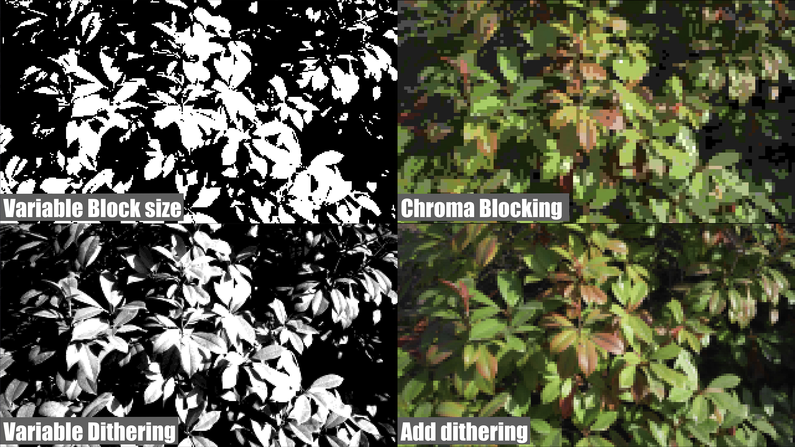

# sqrdots.dctl

Block average (mosaic) + luma/chroma quantization + 4x4 Bayer dither  
ブロック平均（モザイク） + 輝度/彩度の段階量子化 + 4x4 Bayerディザ

> Beta build: 2026-01-30

## Preview / 適用イメージ

## Example video / 作例動画
- https://www.youtube.com/watch?v=Zo1zXXan6OA

## Overview / 概要

sqrdots.dctl is a DaVinci Resolve DCTL that creates a pixelated mosaic look with luma/chroma tone quantization and Bayer dithering. It keeps hue while quantizing chroma magnitude, so you get a retro, blocky look without shifting color direction.

sqrdots.dctl は、ブロック平均（モザイク）と輝度/彩度の段階量子化、Bayer ディザを組み合わせた DCTL です。色相を保ちながら彩度量のみを揺らすため、色転びの少ないレトロな質感が得られます。

## Features / 特徴
- Block-based average color (mosaic)
- Luma tone quantization + 4x4 Bayer dither
- Chroma magnitude quantization + 4x4 Bayer dither
  - Keeps hue and varies only chroma magnitude
- Adjustable chroma scale and blend with original

- Blockごとに平均色（モザイク化）
- Y（輝度）を段階量子化 + 4x4 Bayerディザ
- C（色成分）の大きさ（彩度）を段階量子化 + 4x4 Bayerディザ
  - 色相は保ち、彩度量のみディザで揺らします
- 彩度スケール、元画像とのブレンド調整

## Requirements / 動作要件
- DaVinci Resolve (DCTL compatible)
- Expected input: 0–1 range RGB (sRGB assumed; depends on timeline/node setup)

- DaVinci Resolve（DCTL対応版）
- 期待入力：0〜1レンジのRGB（sRGB想定、タイムライン/ノード構成に依存）
- それ以外の色空間でも動作します。適宜、彩度や輝度レンジを調整してみてください。

## Installation / インストール

### Windows
Place `sqrdots.dctl` in:
`C:\ProgramData\Blackmagic Design\DaVinci Resolve\Support\LUT\DCTL\`

### macOS
Place `sqrdots.dctl` in:
`/Library/Application Support/Blackmagic Design/DaVinci Resolve/LUT/DCTL/`

### Linux
Place `sqrdots.dctl` in:
`/opt/resolve/LUT/DCTL/`

Then restart Resolve (or refresh LUT/DCTL list).

その後、Resolveを再起動（またはLUT/DCTL一覧を更新）。

## Usage / 使い方
- Apply `sqrdots.dctl` as a DCTL on the Color page.
- Block averaging is computationally heavy; large `Block_Size` on high-res footage may be slow.

- ColorページでDCTLとして `sqrdots.dctl` を適用してください。
- ブロック平均は計算量が増えます。高解像度・大きいBlock_Sizeで重い場合があります。

## Parameters / パラメータ

| Parameter | Description (EN) | 説明 (JP) |
| --- | --- | --- |
| `Block_Size` | Block size in pixels. | ブロックサイズ（px） |
| `Luma_Tone_Levels` | Luma tone steps (2–8). | 輝度の段数（2〜8） |
| `Luma_Dither_Str` | Luma dither strength (0 = off). | 輝度ディザ強度（0でOFF） |
| `Chroma_Tone_Levels` | Chroma tone steps (2–8). | 彩度の段数（2〜8） |
| `Chroma_Dither_Str` | Chroma dither strength. | 彩度ディザ強度 |
| `Chroma_Strength` | Global chroma scale (0 = near monochrome). | 全体彩度スケール（0でモノクロ寄り） |
| `Blend` | Blend with original image. | 元画像とのブレンド |

## Notes / 注意
- Output is clipped to 0–1.
- Chroma normalization uses `satN = clip01(|C|)` (saturated in high chroma regions).
- If dither strength exceeds 1.0, the texture can become more generative/unstable.

- 出力は0〜1にクリップします。
- 彩度量の正規化は `satN = clip01(|C|)` を採用しています（強彩度領域は飽和します）。
- ディザ強度が1.0を超えると、生成的/不安定な質感になることがあります。

## License
MIT License (see `LICENSE.txt`).
